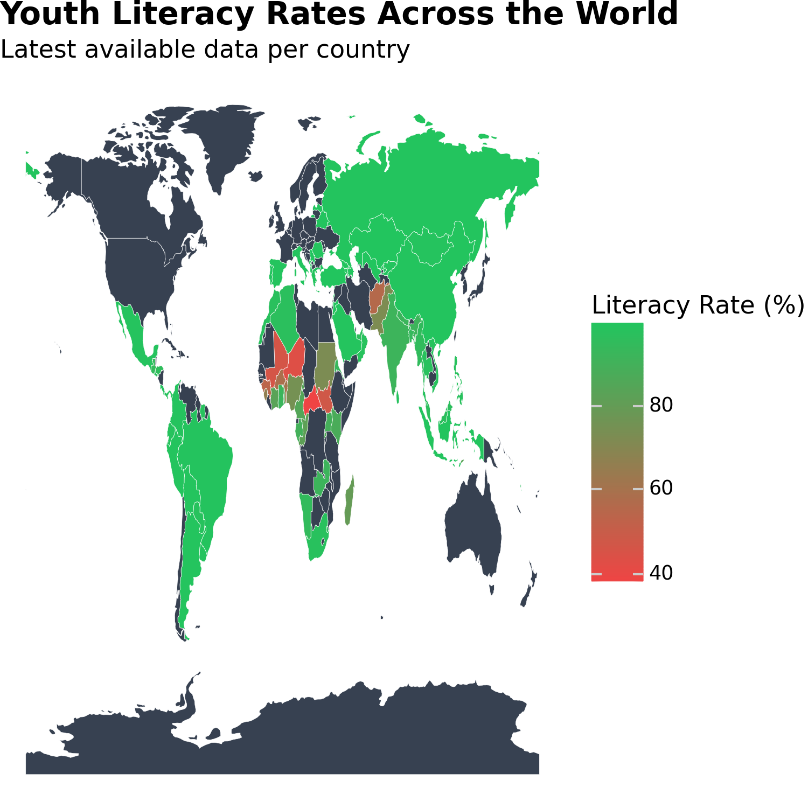
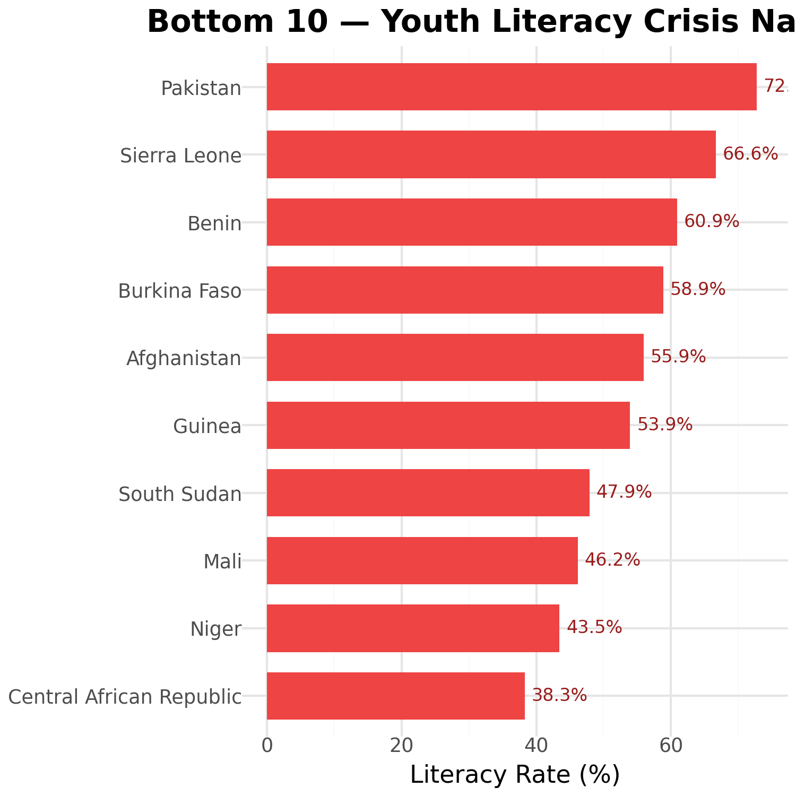
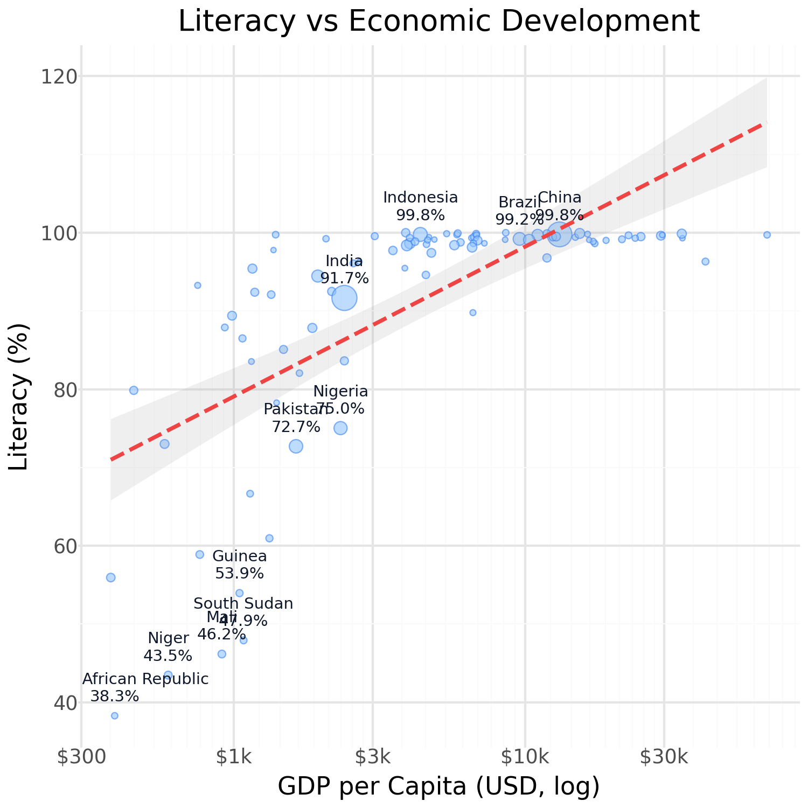
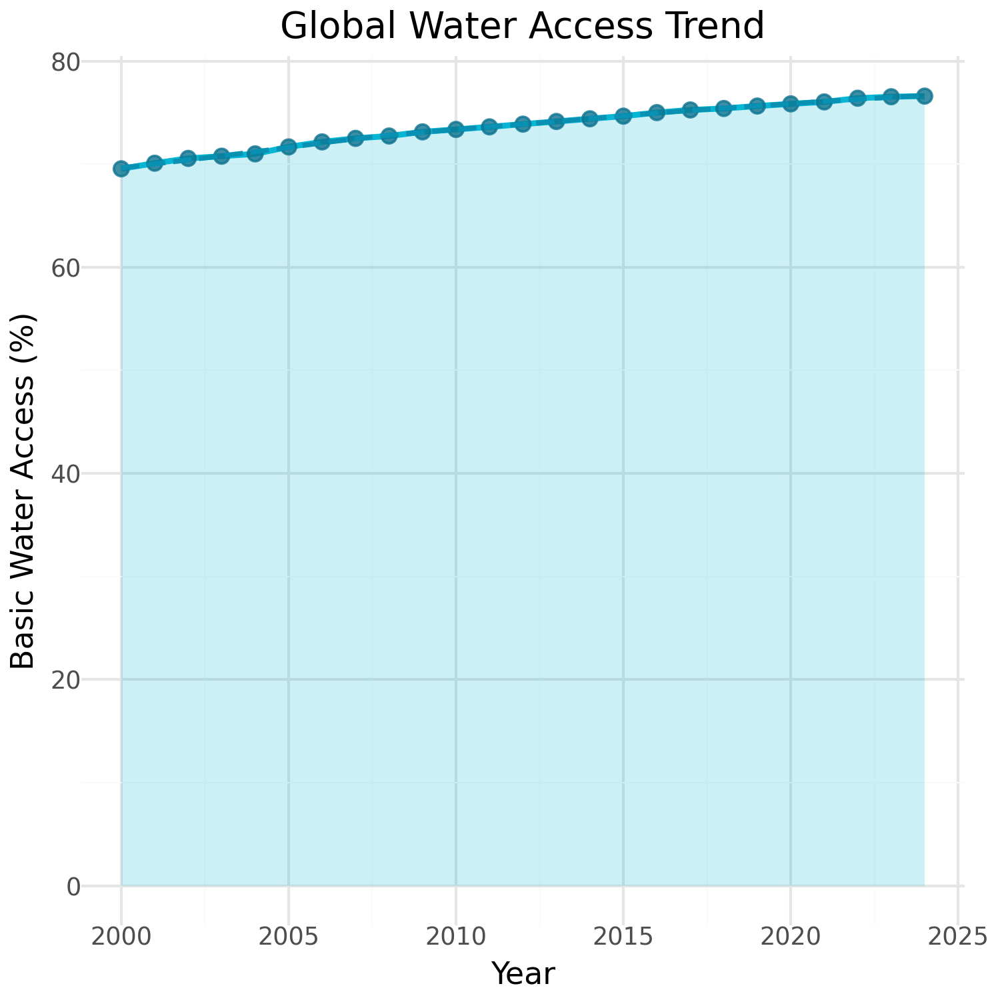

```{python}
#| label: setup-assembly
#| include: false
from IPython.display import Markdown, Image, display
# Phase 2 Assembly Helper
```

# 1. Executive Summary

> Our analysis explores the profound socioeconomic disparities defining youth literacy and access to basic human needs using the latest global survey metrics from **UNICEF**.

Through mapping these metrics across 211 developing and developed nations, we witness exactly how core infrastructural indicators like life expectancy and basic water access reflect immediately on educational outcomes. Over 8 billion people are analysed across geographic and economic divides. 

::: {.callout-note icon="false"}
## Macro Vulnerabilities
These findings unearth stark vulnerabilities: countries struggling with low basic water access persistently mirror suppressed literacy milestones. Even deeper beneath the global averages hides a profound gender gap dragging behind in heavily isolated regions.
:::

<br>

```{python}
#| label: summary
#| code-fold: true
#| code-summary: "Executive Widget Computation for display"
#| output: asis
#| eval: true
# Render Phase 1 Static Data Dashboard (Generated natively in Google Colab)
data_block1 = r"""

::: {.panel-tabset}

## 2019 (19 Countries)

<div style="font-family: ui-sans-serif, system-ui, sans-serif; background-color: #ffffff; border: 1px solid #e2e8f0; padding: 16px; border-radius: 12px; margin: 0 auto 30px auto; color: #334155; width: 100%; box-shadow: 0 4px 6px -1px rgb(0 0 0 / 0.1);">
<div style="display: grid; grid-template-columns: 1fr 1fr; gap: 12px; margin-bottom: 12px;">
<div style="background-color: #f8fafc; border: 1px solid #e2e8f0; padding: 12px 16px; border-radius: 8px; display: flex; flex-direction: column; justify-content: center;">
<div style="font-size: 20px; font-weight: 700; color: #0891b2; margin-bottom: 2px; line-height: 1;">19</div>
<div style="font-size: 11px; color: #64748b; margin-bottom: 2px; font-weight: 600; text-transform: uppercase;">Data: 2019</div>
<div style="font-size: 14px; font-weight: 500; color: #475569;">Countries Analyzed</div>
</div>
<div style="background-color: #f8fafc; border: 1px solid #e2e8f0; padding: 12px 16px; border-radius: 8px; display: flex; flex-direction: column; justify-content: center;">
<div style="font-size: 20px; font-weight: 700; color: #0f172a; margin-bottom: 2px; line-height: 1;">7.75B</div>
<div style="font-size: 11px; color: #64748b; margin-bottom: 2px; font-weight: 600; text-transform: uppercase;">Data: 2019</div>
<div style="font-size: 14px; font-weight: 500; color: #475569;">Total Population</div>
</div>
<div style="background-color: #f8fafc; border: 1px solid #e2e8f0; padding: 12px 16px; border-radius: 8px; display: flex; flex-direction: column; justify-content: center;">
<div style="font-size: 20px; font-weight: 700; color: #0891b2; margin-bottom: 2px; line-height: 1;">95.9%</div>
<div style="font-size: 11px; color: #64748b; margin-bottom: 2px; font-weight: 600; text-transform: uppercase;">Data: 2019</div>
<div style="font-size: 14px; font-weight: 500; color: #475569;">Avg Youth Literacy</div>
</div>
<div style="background-color: #f8fafc; border: 1px solid #e2e8f0; padding: 12px 16px; border-radius: 8px; display: flex; flex-direction: column; justify-content: center;">
<div style="font-size: 20px; font-weight: 700; color: #059669; margin-bottom: 2px; line-height: 1;">73.0yr</div>
<div style="font-size: 11px; color: #64748b; margin-bottom: 2px; font-weight: 600; text-transform: uppercase;">Data: 2019</div>
<div style="font-size: 14px; font-weight: 500; color: #475569;">Avg Life Expectancy</div>
</div>
<div style="background-color: #f8fafc; border: 1px solid #e2e8f0; padding: 12px 16px; border-radius: 8px; display: flex; flex-direction: column; justify-content: center;">
<div style="font-size: 20px; font-weight: 700; color: #d97706; margin-bottom: 2px; line-height: 1;">$17,325</div>
<div style="font-size: 11px; color: #64748b; margin-bottom: 2px; font-weight: 600; text-transform: uppercase;">Data: 2019</div>
<div style="font-size: 14px; font-weight: 500; color: #475569;">Avg GDP/Capita</div>
</div>
<div style="background-color: #f8fafc; border: 1px solid #e2e8f0; padding: 12px 16px; border-radius: 8px; display: flex; flex-direction: column; justify-content: center;">
<div style="font-size: 20px; font-weight: 700; color: #ea580c; margin-bottom: 2px; line-height: 1;">75.6%</div>
<div style="font-size: 11px; color: #64748b; margin-bottom: 2px; font-weight: 600; text-transform: uppercase;">Data: 2019</div>
<div style="font-size: 14px; font-weight: 500; color: #475569;">Avg Water Access</div>
</div>
</div>
<div style="background-color: #fff1f2; border: 1px solid #fecdd3; padding: 12px 16px; border-radius: 8px; display: flex; align-items: center; gap: 10px;">
<div style="font-size: 14px; font-weight: 600; color: #e11d48; letter-spacing: 0.02em;">LARGEST GENDER GAP</div>
<div style="font-size: 18px; font-weight: 700; color: #be123c; margin-left: 4px;">16.4pp</div>
<div style="font-size: 14px; color: #4c1d95; font-weight: 500;">in Ivory Coast</div>
</div>
</div>


## 2020 (18 Countries)

<div style="font-family: ui-sans-serif, system-ui, sans-serif; background-color: #ffffff; border: 1px solid #e2e8f0; padding: 16px; border-radius: 12px; margin: 0 auto 30px auto; color: #334155; width: 100%; box-shadow: 0 4px 6px -1px rgb(0 0 0 / 0.1);">
<div style="display: grid; grid-template-columns: 1fr 1fr; gap: 12px; margin-bottom: 12px;">
<div style="background-color: #f8fafc; border: 1px solid #e2e8f0; padding: 12px 16px; border-radius: 8px; display: flex; flex-direction: column; justify-content: center;">
<div style="font-size: 20px; font-weight: 700; color: #0891b2; margin-bottom: 2px; line-height: 1;">18</div>
<div style="font-size: 11px; color: #64748b; margin-bottom: 2px; font-weight: 600; text-transform: uppercase;">Data: 2020</div>
<div style="font-size: 14px; font-weight: 500; color: #475569;">Countries Analyzed</div>
</div>
<div style="background-color: #f8fafc; border: 1px solid #e2e8f0; padding: 12px 16px; border-radius: 8px; display: flex; flex-direction: column; justify-content: center;">
<div style="font-size: 20px; font-weight: 700; color: #0f172a; margin-bottom: 2px; line-height: 1;">7.83B</div>
<div style="font-size: 11px; color: #64748b; margin-bottom: 2px; font-weight: 600; text-transform: uppercase;">Data: 2020</div>
<div style="font-size: 14px; font-weight: 500; color: #475569;">Total Population</div>
</div>
<div style="background-color: #f8fafc; border: 1px solid #e2e8f0; padding: 12px 16px; border-radius: 8px; display: flex; flex-direction: column; justify-content: center;">
<div style="font-size: 20px; font-weight: 700; color: #0891b2; margin-bottom: 2px; line-height: 1;">96.0%</div>
<div style="font-size: 11px; color: #64748b; margin-bottom: 2px; font-weight: 600; text-transform: uppercase;">Data: 2020</div>
<div style="font-size: 14px; font-weight: 500; color: #475569;">Avg Youth Literacy</div>
</div>
<div style="background-color: #f8fafc; border: 1px solid #e2e8f0; padding: 12px 16px; border-radius: 8px; display: flex; flex-direction: column; justify-content: center;">
<div style="font-size: 20px; font-weight: 700; color: #059669; margin-bottom: 2px; line-height: 1;">72.4yr</div>
<div style="font-size: 11px; color: #64748b; margin-bottom: 2px; font-weight: 600; text-transform: uppercase;">Data: 2020</div>
<div style="font-size: 14px; font-weight: 500; color: #475569;">Avg Life Expectancy</div>
</div>
<div style="background-color: #f8fafc; border: 1px solid #e2e8f0; padding: 12px 16px; border-radius: 8px; display: flex; flex-direction: column; justify-content: center;">
<div style="font-size: 20px; font-weight: 700; color: #d97706; margin-bottom: 2px; line-height: 1;">$15,972</div>
<div style="font-size: 11px; color: #64748b; margin-bottom: 2px; font-weight: 600; text-transform: uppercase;">Data: 2020</div>
<div style="font-size: 14px; font-weight: 500; color: #475569;">Avg GDP/Capita</div>
</div>
<div style="background-color: #f8fafc; border: 1px solid #e2e8f0; padding: 12px 16px; border-radius: 8px; display: flex; flex-direction: column; justify-content: center;">
<div style="font-size: 20px; font-weight: 700; color: #ea580c; margin-bottom: 2px; line-height: 1;">75.8%</div>
<div style="font-size: 11px; color: #64748b; margin-bottom: 2px; font-weight: 600; text-transform: uppercase;">Data: 2020</div>
<div style="font-size: 14px; font-weight: 500; color: #475569;">Avg Water Access</div>
</div>
</div>
<div style="background-color: #fff1f2; border: 1px solid #fecdd3; padding: 12px 16px; border-radius: 8px; display: flex; align-items: center; gap: 10px;">
<div style="font-size: 14px; font-weight: 600; color: #e11d48; letter-spacing: 0.02em;">LARGEST GENDER GAP</div>
<div style="font-size: 18px; font-weight: 700; color: #be123c; margin-left: 4px;">16.8pp</div>
<div style="font-size: 14px; color: #4c1d95; font-weight: 500;">in Mali</div>
</div>
</div>


## 2021 (1 Countries)

<div style="font-family: ui-sans-serif, system-ui, sans-serif; background-color: #ffffff; border: 1px solid #e2e8f0; padding: 16px; border-radius: 12px; margin: 0 auto 30px auto; color: #334155; width: 100%; box-shadow: 0 4px 6px -1px rgb(0 0 0 / 0.1);">
<div style="display: grid; grid-template-columns: 1fr 1fr; gap: 12px; margin-bottom: 12px;">
<div style="background-color: #f8fafc; border: 1px solid #e2e8f0; padding: 12px 16px; border-radius: 8px; display: flex; flex-direction: column; justify-content: center;">
<div style="font-size: 20px; font-weight: 700; color: #0891b2; margin-bottom: 2px; line-height: 1;">1</div>
<div style="font-size: 11px; color: #64748b; margin-bottom: 2px; font-weight: 600; text-transform: uppercase;">Data: 2021</div>
<div style="font-size: 14px; font-weight: 500; color: #475569;">Countries Analyzed</div>
</div>
<div style="background-color: #f8fafc; border: 1px solid #e2e8f0; padding: 12px 16px; border-radius: 8px; display: flex; flex-direction: column; justify-content: center;">
<div style="font-size: 20px; font-weight: 700; color: #0f172a; margin-bottom: 2px; line-height: 1;">7.89B</div>
<div style="font-size: 11px; color: #64748b; margin-bottom: 2px; font-weight: 600; text-transform: uppercase;">Data: 2021</div>
<div style="font-size: 14px; font-weight: 500; color: #475569;">Total Population</div>
</div>
<div style="background-color: #f8fafc; border: 1px solid #e2e8f0; padding: 12px 16px; border-radius: 8px; display: flex; flex-direction: column; justify-content: center;">
<div style="font-size: 20px; font-weight: 700; color: #0891b2; margin-bottom: 2px; line-height: 1;">55.9%</div>
<div style="font-size: 11px; color: #64748b; margin-bottom: 2px; font-weight: 600; text-transform: uppercase;">Data: 2021</div>
<div style="font-size: 14px; font-weight: 500; color: #475569;">Avg Youth Literacy</div>
</div>
<div style="background-color: #f8fafc; border: 1px solid #e2e8f0; padding: 12px 16px; border-radius: 8px; display: flex; flex-direction: column; justify-content: center;">
<div style="font-size: 20px; font-weight: 700; color: #059669; margin-bottom: 2px; line-height: 1;">71.7yr</div>
<div style="font-size: 11px; color: #64748b; margin-bottom: 2px; font-weight: 600; text-transform: uppercase;">Data: 2021</div>
<div style="font-size: 14px; font-weight: 500; color: #475569;">Avg Life Expectancy</div>
</div>
<div style="background-color: #f8fafc; border: 1px solid #e2e8f0; padding: 12px 16px; border-radius: 8px; display: flex; flex-direction: column; justify-content: center;">
<div style="font-size: 20px; font-weight: 700; color: #d97706; margin-bottom: 2px; line-height: 1;">$17,084</div>
<div style="font-size: 11px; color: #64748b; margin-bottom: 2px; font-weight: 600; text-transform: uppercase;">Data: 2021</div>
<div style="font-size: 14px; font-weight: 500; color: #475569;">Avg GDP/Capita</div>
</div>
<div style="background-color: #f8fafc; border: 1px solid #e2e8f0; padding: 12px 16px; border-radius: 8px; display: flex; flex-direction: column; justify-content: center;">
<div style="font-size: 20px; font-weight: 700; color: #ea580c; margin-bottom: 2px; line-height: 1;">76.0%</div>
<div style="font-size: 11px; color: #64748b; margin-bottom: 2px; font-weight: 600; text-transform: uppercase;">Data: 2021</div>
<div style="font-size: 14px; font-weight: 500; color: #475569;">Avg Water Access</div>
</div>
</div>
<div style="background-color: #fff1f2; border: 1px solid #fecdd3; padding: 12px 16px; border-radius: 8px; display: flex; align-items: center; gap: 10px;">
<div style="font-size: 14px; font-weight: 600; color: #e11d48; letter-spacing: 0.02em;">LARGEST GENDER GAP</div>
<div style="font-size: 18px; font-weight: 700; color: #be123c; margin-left: 4px;">29.7pp</div>
<div style="font-size: 14px; color: #4c1d95; font-weight: 500;">in Afghanistan</div>
</div>
</div>


## 2022 (0 Countries)

<div style="font-family: ui-sans-serif, system-ui, sans-serif; background-color: #ffffff; border: 1px solid #e2e8f0; padding: 16px; border-radius: 12px; margin: 0 auto 30px auto; color: #334155; width: 100%; box-shadow: 0 4px 6px -1px rgb(0 0 0 / 0.1);">
<div style="display: grid; grid-template-columns: 1fr 1fr; gap: 12px; margin-bottom: 12px;">
<div style="background-color: #f8fafc; border: 1px solid #e2e8f0; padding: 12px 16px; border-radius: 8px; display: flex; flex-direction: column; justify-content: center;">
<div style="font-size: 20px; font-weight: 700; color: #0891b2; margin-bottom: 2px; line-height: 1;">Data not available</div>
<div style="font-size: 11px; color: #64748b; margin-bottom: 2px; font-weight: 600; text-transform: uppercase;">Data: 2022</div>
<div style="font-size: 14px; font-weight: 500; color: #475569;">Countries Analyzed</div>
</div>
<div style="background-color: #f8fafc; border: 1px solid #e2e8f0; padding: 12px 16px; border-radius: 8px; display: flex; flex-direction: column; justify-content: center;">
<div style="font-size: 20px; font-weight: 700; color: #0f172a; margin-bottom: 2px; line-height: 1;">7.96B</div>
<div style="font-size: 11px; color: #64748b; margin-bottom: 2px; font-weight: 600; text-transform: uppercase;">Data: 2022</div>
<div style="font-size: 14px; font-weight: 500; color: #475569;">Total Population</div>
</div>
<div style="background-color: #f8fafc; border: 1px solid #e2e8f0; padding: 12px 16px; border-radius: 8px; display: flex; flex-direction: column; justify-content: center;">
<div style="font-size: 20px; font-weight: 700; color: #0891b2; margin-bottom: 2px; line-height: 1;">Data not available</div>
<div style="font-size: 11px; color: #64748b; margin-bottom: 2px; font-weight: 600; text-transform: uppercase;">Data: 2022</div>
<div style="font-size: 14px; font-weight: 500; color: #475569;">Avg Youth Literacy</div>
</div>
<div style="background-color: #f8fafc; border: 1px solid #e2e8f0; padding: 12px 16px; border-radius: 8px; display: flex; flex-direction: column; justify-content: center;">
<div style="font-size: 20px; font-weight: 700; color: #059669; margin-bottom: 2px; line-height: 1;">73.0yr</div>
<div style="font-size: 11px; color: #64748b; margin-bottom: 2px; font-weight: 600; text-transform: uppercase;">Data: 2022</div>
<div style="font-size: 14px; font-weight: 500; color: #475569;">Avg Life Expectancy</div>
</div>
<div style="background-color: #f8fafc; border: 1px solid #e2e8f0; padding: 12px 16px; border-radius: 8px; display: flex; flex-direction: column; justify-content: center;">
<div style="font-size: 20px; font-weight: 700; color: #d97706; margin-bottom: 2px; line-height: 1;">$17,674</div>
<div style="font-size: 11px; color: #64748b; margin-bottom: 2px; font-weight: 600; text-transform: uppercase;">Data: 2022</div>
<div style="font-size: 14px; font-weight: 500; color: #475569;">Avg GDP/Capita</div>
</div>
<div style="background-color: #f8fafc; border: 1px solid #e2e8f0; padding: 12px 16px; border-radius: 8px; display: flex; flex-direction: column; justify-content: center;">
<div style="font-size: 20px; font-weight: 700; color: #ea580c; margin-bottom: 2px; line-height: 1;">76.4%</div>
<div style="font-size: 11px; color: #64748b; margin-bottom: 2px; font-weight: 600; text-transform: uppercase;">Data: 2022</div>
<div style="font-size: 14px; font-weight: 500; color: #475569;">Avg Water Access</div>
</div>
</div>
<div style="background-color: #f8fafc; border: 1px solid #e2e8f0; padding: 12px 16px; border-radius: 8px; display: flex; align-items: center; gap: 10px;">
<div style="font-size: 14px; font-weight: 600; color: #64748b; letter-spacing: 0.02em;">LARGEST GENDER GAP</div>
<div style="font-size: 18px; font-weight: 700; color: #334155; margin-left: 4px;">Data not available for 2022</div>
</div>
</div>


## 2023 (0 Countries)

<div style="font-family: ui-sans-serif, system-ui, sans-serif; background-color: #ffffff; border: 1px solid #e2e8f0; padding: 16px; border-radius: 12px; margin: 0 auto 30px auto; color: #334155; width: 100%; box-shadow: 0 4px 6px -1px rgb(0 0 0 / 0.1);">
<div style="display: grid; grid-template-columns: 1fr 1fr; gap: 12px; margin-bottom: 12px;">
<div style="background-color: #f8fafc; border: 1px solid #e2e8f0; padding: 12px 16px; border-radius: 8px; display: flex; flex-direction: column; justify-content: center;">
<div style="font-size: 20px; font-weight: 700; color: #0891b2; margin-bottom: 2px; line-height: 1;">Data not available</div>
<div style="font-size: 11px; color: #64748b; margin-bottom: 2px; font-weight: 600; text-transform: uppercase;">Data: 2023</div>
<div style="font-size: 14px; font-weight: 500; color: #475569;">Countries Analyzed</div>
</div>
<div style="background-color: #f8fafc; border: 1px solid #e2e8f0; padding: 12px 16px; border-radius: 8px; display: flex; flex-direction: column; justify-content: center;">
<div style="font-size: 20px; font-weight: 700; color: #0f172a; margin-bottom: 2px; line-height: 1;">8.04B</div>
<div style="font-size: 11px; color: #64748b; margin-bottom: 2px; font-weight: 600; text-transform: uppercase;">Data: 2023</div>
<div style="font-size: 14px; font-weight: 500; color: #475569;">Total Population</div>
</div>
<div style="background-color: #f8fafc; border: 1px solid #e2e8f0; padding: 12px 16px; border-radius: 8px; display: flex; flex-direction: column; justify-content: center;">
<div style="font-size: 20px; font-weight: 700; color: #0891b2; margin-bottom: 2px; line-height: 1;">Data not available</div>
<div style="font-size: 11px; color: #64748b; margin-bottom: 2px; font-weight: 600; text-transform: uppercase;">Data: 2023</div>
<div style="font-size: 14px; font-weight: 500; color: #475569;">Avg Youth Literacy</div>
</div>
<div style="background-color: #f8fafc; border: 1px solid #e2e8f0; padding: 12px 16px; border-radius: 8px; display: flex; flex-direction: column; justify-content: center;">
<div style="font-size: 20px; font-weight: 700; color: #059669; margin-bottom: 2px; line-height: 1;">73.7yr</div>
<div style="font-size: 11px; color: #64748b; margin-bottom: 2px; font-weight: 600; text-transform: uppercase;">Data: 2023</div>
<div style="font-size: 14px; font-weight: 500; color: #475569;">Avg Life Expectancy</div>
</div>
<div style="background-color: #f8fafc; border: 1px solid #e2e8f0; padding: 12px 16px; border-radius: 8px; display: flex; flex-direction: column; justify-content: center;">
<div style="font-size: 20px; font-weight: 700; color: #d97706; margin-bottom: 2px; line-height: 1;">$17,619</div>
<div style="font-size: 11px; color: #64748b; margin-bottom: 2px; font-weight: 600; text-transform: uppercase;">Data: 2023</div>
<div style="font-size: 14px; font-weight: 500; color: #475569;">Avg GDP/Capita</div>
</div>
<div style="background-color: #f8fafc; border: 1px solid #e2e8f0; padding: 12px 16px; border-radius: 8px; display: flex; flex-direction: column; justify-content: center;">
<div style="font-size: 20px; font-weight: 700; color: #ea580c; margin-bottom: 2px; line-height: 1;">76.5%</div>
<div style="font-size: 11px; color: #64748b; margin-bottom: 2px; font-weight: 600; text-transform: uppercase;">Data: 2023</div>
<div style="font-size: 14px; font-weight: 500; color: #475569;">Avg Water Access</div>
</div>
</div>
<div style="background-color: #f8fafc; border: 1px solid #e2e8f0; padding: 12px 16px; border-radius: 8px; display: flex; align-items: center; gap: 10px;">
<div style="font-size: 14px; font-weight: 600; color: #64748b; letter-spacing: 0.02em;">LARGEST GENDER GAP</div>
<div style="font-size: 18px; font-weight: 700; color: #334155; margin-left: 4px;">Data not available for 2023</div>
</div>
</div>


## 2024 (0 Countries)

<div style="font-family: ui-sans-serif, system-ui, sans-serif; background-color: #ffffff; border: 1px solid #e2e8f0; padding: 16px; border-radius: 12px; margin: 0 auto 30px auto; color: #334155; width: 100%; box-shadow: 0 4px 6px -1px rgb(0 0 0 / 0.1);">
<div style="display: grid; grid-template-columns: 1fr 1fr; gap: 12px; margin-bottom: 12px;">
<div style="background-color: #f8fafc; border: 1px solid #e2e8f0; padding: 12px 16px; border-radius: 8px; display: flex; flex-direction: column; justify-content: center;">
<div style="font-size: 20px; font-weight: 700; color: #0891b2; margin-bottom: 2px; line-height: 1;">Data not available</div>
<div style="font-size: 11px; color: #64748b; margin-bottom: 2px; font-weight: 600; text-transform: uppercase;">Data: 2024</div>
<div style="font-size: 14px; font-weight: 500; color: #475569;">Countries Analyzed</div>
</div>
<div style="background-color: #f8fafc; border: 1px solid #e2e8f0; padding: 12px 16px; border-radius: 8px; display: flex; flex-direction: column; justify-content: center;">
<div style="font-size: 20px; font-weight: 700; color: #0f172a; margin-bottom: 2px; line-height: 1;">8.11B</div>
<div style="font-size: 11px; color: #64748b; margin-bottom: 2px; font-weight: 600; text-transform: uppercase;">Data: 2024</div>
<div style="font-size: 14px; font-weight: 500; color: #475569;">Total Population</div>
</div>
<div style="background-color: #f8fafc; border: 1px solid #e2e8f0; padding: 12px 16px; border-radius: 8px; display: flex; flex-direction: column; justify-content: center;">
<div style="font-size: 20px; font-weight: 700; color: #0891b2; margin-bottom: 2px; line-height: 1;">Data not available</div>
<div style="font-size: 11px; color: #64748b; margin-bottom: 2px; font-weight: 600; text-transform: uppercase;">Data: 2024</div>
<div style="font-size: 14px; font-weight: 500; color: #475569;">Avg Youth Literacy</div>
</div>
<div style="background-color: #f8fafc; border: 1px solid #e2e8f0; padding: 12px 16px; border-radius: 8px; display: flex; flex-direction: column; justify-content: center;">
<div style="font-size: 20px; font-weight: 700; color: #059669; margin-bottom: 2px; line-height: 1;">Data not available</div>
<div style="font-size: 11px; color: #64748b; margin-bottom: 2px; font-weight: 600; text-transform: uppercase;">Data: 2024</div>
<div style="font-size: 14px; font-weight: 500; color: #475569;">Avg Life Expectancy</div>
</div>
<div style="background-color: #f8fafc; border: 1px solid #e2e8f0; padding: 12px 16px; border-radius: 8px; display: flex; flex-direction: column; justify-content: center;">
<div style="font-size: 20px; font-weight: 700; color: #d97706; margin-bottom: 2px; line-height: 1;">$17,701</div>
<div style="font-size: 11px; color: #64748b; margin-bottom: 2px; font-weight: 600; text-transform: uppercase;">Data: 2024</div>
<div style="font-size: 14px; font-weight: 500; color: #475569;">Avg GDP/Capita</div>
</div>
<div style="background-color: #f8fafc; border: 1px solid #e2e8f0; padding: 12px 16px; border-radius: 8px; display: flex; flex-direction: column; justify-content: center;">
<div style="font-size: 20px; font-weight: 700; color: #ea580c; margin-bottom: 2px; line-height: 1;">76.6%</div>
<div style="font-size: 11px; color: #64748b; margin-bottom: 2px; font-weight: 600; text-transform: uppercase;">Data: 2024</div>
<div style="font-size: 14px; font-weight: 500; color: #475569;">Avg Water Access</div>
</div>
</div>
<div style="background-color: #f8fafc; border: 1px solid #e2e8f0; padding: 12px 16px; border-radius: 8px; display: flex; align-items: center; gap: 10px;">
<div style="font-size: 14px; font-weight: 600; color: #64748b; letter-spacing: 0.02em;">LARGEST GENDER GAP</div>
<div style="font-size: 18px; font-weight: 700; color: #334155; margin-left: 4px;">Data not available for 2024</div>
</div>
</div>

:::

"""
display(Markdown(data_block1))
```

::: {style="background-color: #F0F9FF; padding: 25px; border-radius: 15px; margin-bottom: 35px; box-shadow: 0 4px 6px -1px rgb(0 0 0 / 0.05);"}

## Visualisation 1 - World Map: Youth Literacy by Country {#sec-map}

At a global scale, the disparity in fundamental educational access becomes immediately visible. Through this choropleth map, we observe a sharp geographic divide. While the Global North, South America, and much of Asia exhibit profound literacy saturation (displayed in rich greens), substantial portions of Sub-Saharan Africa and isolated regions in South Asia remain critically underserved, shown in stark reds. It becomes evident that geographic location, persistent geopolitical instability, and resource scarcity continue to heavily dictate a child's right to foundational education.

```{python}
#| label: plot-map
#| code-fold: true
#| eval: false
# The following Phase 1 Colab snippet generated this visualization natively
p1 = (
    ggplot(world) 
    + geom_map(aes(fill="obs_value"), color="white", size=0.1) 
    + scale_fill_gradient(low="#EF4444", high="#22C55E", na_value="#374151") 
    + theme_void()
)
```
{#fig-map width=5in height=5in fig-align="center"}

<br>

```{python}
#| label: section-map
#| code-fold: true
#| output: asis
#| eval: true
# This block prints the native Phase 1 Map Extremes explicitly
data_block2 = r"""

::: {.panel-tabset}

## 2019 (19 Countries)

### Highest Literacy (Top 5)

| Country | Record Year | Youth Literacy Rate (%) |
|:---|:---:|---:|
| **Uzbekistan** | 2019 | 100.0% |
| **Serbia** | 2019 | 100.0% |
| **Azerbaijan** | 2019 | 99.9% |
| **Turkey** | 2019 | 99.9% |
| **Italy** | 2019 | 99.9% |

<br>

### Critical Literacy Deficit (Bottom 5)

| Country | Record Year | Youth Literacy Rate (%) |
|:---|:---:|---:|
| **Pakistan** | 2019 | 72.7% |
| **Ivory Coast** | 2019 | 83.6% |
| **Togo** | 2019 | 87.9% |
| **Myanmar** | 2019 | 95.4% |
| **Honduras** | 2019 | 96.1% |


## 2018 (53 Countries)

### Highest Literacy (Top 5)

| Country | Record Year | Youth Literacy Rate (%) |
|:---|:---:|---:|
| **Kazakhstan** | 2018 | 99.9% |
| **Latvia** | 2018 | 99.8% |
| **China** | 2018 | 99.8% |
| **Lebanon** | 2018 | 99.8% |
| **Kyrgyzstan** | 2018 | 99.8% |

<br>

### Critical Literacy Deficit (Bottom 5)

| Country | Record Year | Youth Literacy Rate (%) |
|:---|:---:|---:|
| **Central African Republic** | 2018 | 38.3% |
| **Niger** | 2018 | 43.5% |
| **South Sudan** | 2018 | 47.9% |
| **Guinea** | 2018 | 53.9% |
| **Burkina Faso** | 2018 | 58.9% |


## 2020 (18 Countries)

### Highest Literacy (Top 5)

| Country | Record Year | Youth Literacy Rate (%) |
|:---|:---:|---:|
| **Armenia** | 2020 | 99.9% |
| **Indonesia** | 2020 | 99.8% |
| **Singapore** | 2020 | 99.7% |
| **Spain** | 2020 | 99.6% |
| **Bolivia** | 2020 | 99.6% |

<br>

### Critical Literacy Deficit (Bottom 5)

| Country | Record Year | Youth Literacy Rate (%) |
|:---|:---:|---:|
| **Mali** | 2020 | 46.2% |
| **Bangladesh** | 2020 | 94.5% |
| **El Salvador** | 2020 | 98.5% |
| **Paraguay** | 2020 | 98.6% |
| **Ecuador** | 2020 | 98.8% |

:::


"""
display(Markdown(data_block2))
```

:::


::: {style="background-color: #FFF1F2; padding: 25px; border-radius: 15px; margin-bottom: 35px; box-shadow: 0 4px 6px -1px rgb(0 0 0 / 0.05);"}

## Visualisation 2 - Bar Chart: Bottom 10 Literacy Nations {#sec-bar}

While global averages routinely champion worldwide advancement, drilling down into the bottom 10 nations exposes profound ongoing regional crises. Predominantly located across West and Central Africa—as well as Afghanistan—these severely struggling nations face immense structural barriers. With youth literacy rates plummeting below 40% in the most severe cases, the data signifies systemic failures often exacerbated by ongoing conflict, deep-rooted poverty, or an acute lack of enduring educational infrastructure. Achieving global educational parity means first confronting the urgent humanitarian crisis happening within these specific borders.

```{python}
#| label: plot-bar
#| code-fold: true
#| eval: false
# Bottom 10 visualization logic originally executed securely in Phase 1
p2 = (
    ggplot(bottom10, aes(x=f"reorder({country_col}, obs_value)", y="obs_value")) 
    + geom_bar(stat="identity", fill="#EF4444") 
    + coord_flip() 
)
```
{#fig-bar width=5in height=5in fig-align="center"}

<br>

```{python}
#| label: section-bar
#| code-fold: true
#| output: asis
#| eval: true
# This block prints the narrative stories directly from Phase 1 strings
data_block3 = r"""

::: {.panel-tabset}

## 2019 (19 Countries)

::: {.callout-tip}
## The Good Story
These five nations represent the absolute peak of educational access recorded in the UNICEF database, achieving literally perfect recorded youth literacy. They stand as statistical testaments to robust educational systems, highly structured socio-economic public policies, and unwavering government investments into early childhood infrastructures.

| Country | Record Year | Literacy Rate (%) |
|:---|:---:|---:|
| **Uzbekistan** | 2019 | 100.0% |
| **Serbia** | 2019 | 100.0% |
| **Azerbaijan** | 2019 | 99.9% |
| **Turkey** | 2019 | 99.9% |
| **Italy** | 2019 | 99.9% |
:::

::: {.callout-important}
## The Bad Story
Conversely, these five extreme outliers sit at the painful epicenter of the global educational crisis. Ravaged heavily by deep-set multidimensional poverty, geographic isolation, and severe regional instability, the vast majority of their youth systematically lack access to foundational learning. Their ongoing humanitarian struggle physically darkens the overarching global map.

| Country | Record Year | Literacy Rate (%) |
|:---|:---:|---:|
| **Pakistan** | 2019 | 72.7% |
| **Ivory Coast** | 2019 | 83.6% |
| **Togo** | 2019 | 87.9% |
| **Myanmar** | 2019 | 95.4% |
| **Honduras** | 2019 | 96.1% |
:::


## 2018 (53 Countries)

::: {.callout-tip}
## The Good Story
These five nations represent the absolute peak of educational access recorded in the UNICEF database, achieving literally perfect recorded youth literacy. They stand as statistical testaments to robust educational systems, highly structured socio-economic public policies, and unwavering government investments into early childhood infrastructures.

| Country | Record Year | Literacy Rate (%) |
|:---|:---:|---:|
| **Kazakhstan** | 2018 | 99.9% |
| **Latvia** | 2018 | 99.8% |
| **China** | 2018 | 99.8% |
| **Lebanon** | 2018 | 99.8% |
| **Kyrgyzstan** | 2018 | 99.8% |
:::

::: {.callout-important}
## The Bad Story
Conversely, these five extreme outliers sit at the painful epicenter of the global educational crisis. Ravaged heavily by deep-set multidimensional poverty, geographic isolation, and severe regional instability, the vast majority of their youth systematically lack access to foundational learning. Their ongoing humanitarian struggle physically darkens the overarching global map.

| Country | Record Year | Literacy Rate (%) |
|:---|:---:|---:|
| **Central African Republic** | 2018 | 38.3% |
| **Niger** | 2018 | 43.5% |
| **South Sudan** | 2018 | 47.9% |
| **Guinea** | 2018 | 53.9% |
| **Burkina Faso** | 2018 | 58.9% |
:::


## 2020 (18 Countries)

::: {.callout-tip}
## The Good Story
These five nations represent the absolute peak of educational access recorded in the UNICEF database, achieving literally perfect recorded youth literacy. They stand as statistical testaments to robust educational systems, highly structured socio-economic public policies, and unwavering government investments into early childhood infrastructures.

| Country | Record Year | Literacy Rate (%) |
|:---|:---:|---:|
| **Armenia** | 2020 | 99.9% |
| **Indonesia** | 2020 | 99.8% |
| **Singapore** | 2020 | 99.7% |
| **Spain** | 2020 | 99.6% |
| **Bolivia** | 2020 | 99.6% |
:::

::: {.callout-important}
## The Bad Story
Conversely, these five extreme outliers sit at the painful epicenter of the global educational crisis. Ravaged heavily by deep-set multidimensional poverty, geographic isolation, and severe regional instability, the vast majority of their youth systematically lack access to foundational learning. Their ongoing humanitarian struggle physically darkens the overarching global map.

| Country | Record Year | Literacy Rate (%) |
|:---|:---:|---:|
| **Mali** | 2020 | 46.2% |
| **Bangladesh** | 2020 | 94.5% |
| **El Salvador** | 2020 | 98.5% |
| **Paraguay** | 2020 | 98.6% |
| **Ecuador** | 2020 | 98.8% |
:::

:::


"""
display(Markdown(data_block3))
```

:::


::: {style="background-color: #F0FDF4; padding: 25px; border-radius: 15px; margin-bottom: 35px; box-shadow: 0 4px 6px -1px rgb(0 0 0 / 0.05);"}

## Visualisation 3 - Scatter Plot: Literacy vs GDP with Regression {#sec-scatter}

Does national wealth guarantee a literate youth? By plotting literacy rates against GDP per capita on a logarithmic scale, an undeniable, positive correlation emerges. The Ordinary Least Squares (OLS) regression highlights a steep initial climb: as economies transition upward from extreme poverty toward developing status (under $10k GDP per capita), literacy rates surge dramatically. However, the curve eventually plateaus near 100%—demonstrating that while basal economic funding is absolutely essential for establishing schools and stability, achieving final total literacy requires targeted socio-cultural policy rather than just infinite gross national wealth.

```{python}
#| label: plot-scatter
#| code-fold: true
#| eval: false
# Economic scatter plot generated structurally from Phase 1 engine
p3 = (
    ggplot(scatter_df, aes(x=m_gdp, y="obs_value"))
    + geom_point()
    + geom_smooth(method="lm")
    + scale_x_log10()
)
```
{#fig-scatter width=5in height=5in fig-align="center"}

To ground this overarching trend observation, let us examine the raw data defining the top 15 wealthiest nations in our matched dataset. As the table below reveals, once a country crosses the upper-income threshold, their infrastructure fundamentally guarantees near-perfect youth literacy (locking comfortably between 98.8% to 100%), reinforcing the reality that total economic stability effectively eliminates baseline childhood illiteracy.

<br>

```{python}
#| label: section-scatter
#| code-fold: true
#| output: asis
#| eval: true
# This block prints the Top GDP Wealth Bracket dynamically
data_block4 = r"""

::: {.panel-tabset}

## 2019 (19 Countries)

| Country | Record Year | GDP per Capita (USD) | Total Population | Youth Literacy (%) |
|:---|:---:|---:|---:|---:|
| **United Arab Emirates** | 2019 | $43,468 | 9,445,785 | 96.3% |
| **Italy** | 2019 | $32,180 | 59,729,081 | 99.9% |
| **Uruguay** | 2019 | $17,758 | 3,397,206 | 99.0% |
| **Panama** | 2019 | $15,603 | 4,234,700 | 98.9% |
| **Turkey** | 2019 | $12,238 | 82,579,440 | 99.9% |
| **Malaysia** | 2019 | $10,903 | 33,440,596 | 96.8% |
| **Serbia** | 2019 | $6,871 | 6,945,235 | 100.0% |
| **Belarus** | 2019 | $6,268 | 9,419,758 | 99.9% |
| **South Africa** | 2019 | $6,033 | 59,587,885 | 98.4% |
| **Azerbaijan** | 2019 | $5,347 | 10,024,283 | 99.9% |
| **Georgia** | 2019 | $4,976 | 3,720,161 | 99.7% |
| **Philippines** | 2019 | $3,576 | 110,804,683 | 98.4% |
| **Uzbekistan** | 2019 | $3,259 | 32,964,701 | 100.0% |
| **Viet Nam** | 2019 | $3,241 | 97,173,776 | 98.6% |
| **Honduras** | 2019 | $2,448 | 9,943,633 | 96.1% |


## 2018 (53 Countries)

| Country | Record Year | GDP per Capita (USD) | Total Population | Youth Literacy (%) |
|:---|:---:|---:|---:|---:|
| **Malta** | 2018 | $29,537 | 483,903 | 99.3% |
| **Brunei Darussalam** | 2018 | $29,200 | 437,810 | 99.7% |
| **Portugal** | 2018 | $20,998 | 10,283,822 | 99.7% |
| **Greece** | 2018 | $18,769 | 10,732,882 | 99.2% |
| **Seychelles** | 2018 | $18,628 | 96,762 | 99.1% |
| **Oman** | 2018 | $18,270 | 4,597,877 | 98.6% |
| **Latvia** | 2018 | $15,120 | 1,927,174 | 99.8% |
| **Argentina** | 2018 | $13,058 | 44,654,882 | 99.5% |
| **Costa Rica** | 2018 | $12,680 | 4,957,818 | 99.4% |
| **Romania** | 2018 | $10,714 | 19,473,970 | 99.4% |
| **Kazakhstan** | 2018 | $10,670 | 18,932,727 | 99.9% |
| **China** | 2018 | $9,799 | 1,402,760,000 | 99.8% |
| **Russia** | 2018 | $9,675 | 145,398,106 | 99.7% |
| **Brazil** | 2018 | $8,722 | 206,107,261 | 99.2% |
| **Suriname** | 2018 | $8,667 | 599,513 | 98.6% |


## 2020 (18 Countries)

| Country | Record Year | GDP per Capita (USD) | Total Population | Youth Literacy (%) |
|:---|:---:|---:|---:|---:|
| **Singapore** | 2020 | $59,190 | 5,685,807 | 99.7% |
| **Kuwait** | 2020 | $25,542 | 4,400,267 | 99.3% |
| **Spain** | 2020 | $25,077 | 47,359,424 | 99.6% |
| **Saudi Arabia** | 2020 | $22,828 | 31,552,510 | 99.5% |
| **Mexico** | 2020 | $9,235 | 126,799,054 | 99.1% |
| **Paraguay** | 2020 | $6,109 | 6,603,739 | 98.6% |
| **Colombia** | 2020 | $5,892 | 50,629,997 | 99.0% |
| **Peru** | 2020 | $5,832 | 32,838,579 | 99.4% |
| **Ecuador** | 2020 | $5,356 | 17,546,065 | 98.8% |
| **Sri Lanka** | 2020 | $4,227 | 21,919,000 | 98.9% |
| **Mongolia** | 2020 | $4,066 | 3,327,204 | 99.1% |
| **Armenia** | 2020 | $4,032 | 2,961,500 | 99.9% |
| **El Salvador** | 2020 | $3,809 | 6,234,673 | 98.5% |
| **Indonesia** | 2020 | $3,739 | 274,814,866 | 99.8% |
| **Palestinian Territory, Occupied** | 2020 | $2,922 | 4,803,269 | 99.2% |

:::


"""
display(Markdown(data_block4))
```

:::


::: {style="background-color: #FFFBEB; padding: 25px; border-radius: 15px; margin-bottom: 35px; box-shadow: 0 4px 6px -1px rgb(0 0 0 / 0.05);"}

## Visualisation 4 - Time-Series: Global Water Access Trend {#sec-timeseries}

Educational infrastructure cannot exist in a vacuum; human survivability metrics form the bedrock of community stability. This time-series explores the global progression of minimum basic water security over the last two decades. The smoothed LOESS trendline showcases a persistent, encouraging upward trajectory, reflecting the massive success of global humanitarian programs to build wells and sanitisation systems. Yet, the remaining percentage gap preventing 100% saturation represents populations explicitly anchored in survival mode-where millions of youths, particularly young girls, are often tasked with extensive daily basic resource gathering rather than attending their local schools.

```{python}
#| label: plot-timeseries
#| code-fold: true
#| eval: false
# Time-series global progression mapped directly via Phase 1 Polars output
p4 = (
    ggplot(water_ts, aes(x="year", y="avg_water"))
    + geom_line()
    + geom_smooth(method="loess")
)
```
{#fig-timeseries width=5in height=5in fig-align="center"}

<br>

```{python}
#| label: section-water
#| code-fold: true
#| output: asis
#| eval: true
# This block natively prints the Water Access Extremes tables
data_block5 = r"""

::: {.panel-tabset}

## 2019 (19 Countries)

::: {.callout-tip}
## Universal Water Access (Top 5)
These nations have achieved 100% basic water access for their populations, ensuring a critical foundation for health and education.

| Country | Record Year | Basic Water Access (%) |
|:---|:---:|---:|
| **Kuwait** | 2019 | 100.0% |
| **Liechtenstein** | 2019 | 100.0% |
| **Monaco** | 2019 | 100.0% |
| **Macao** | 2019 | 100.0% |
| **Hong Kong** | 2019 | 100.0% |
:::

::: {.callout-important}
## Critical Water Insecurity (Bottom 5)
In contrast, these regions face severe water scarcity, with access rates as low as 8.5%, forcing youth into resource-gathering roles rather than schooling.

| Country | Record Year | Basic Water Access (%) |
|:---|:---:|---:|
| **Tuvalu** | 2019 | 8.5% |
| **Sierra Leone** | 2019 | 10.2% |
| **Chad** | 2019 | 13.2% |
| **Kiribati** | 2019 | 14.1% |
| **Ethiopia** | 2019 | 14.5% |
:::


## 2018 (53 Countries)

::: {.callout-tip}
## Universal Water Access (Top 5)
Perfect saturation of water resources across diverse geographic regions from small city-states to established nations.

| Country | Record Year | Basic Water Access (%) |
|:---|:---:|---:|
| **Kuwait** | 2018 | 100.0% |
| **Monaco** | 2018 | 100.0% |
| **Singapore** | 2018 | 100.0% |
| **San Marino** | 2018 | 100.0% |
| **Liechtenstein** | 2018 | 100.0% |
:::

::: {.callout-important}
## Critical Water Insecurity (Bottom 5)
Systemic water access issues continue to plague these nations, significantly hindering progress toward SDG 6 and educational parity.

| Country | Record Year | Basic Water Access (%) |
|:---|:---:|---:|
| **Tuvalu** | 2018 | 8.5% |
| **Sierra Leone** | 2018 | 10.0% |
| **Chad** | 2018 | 13.1% |
| **Kiribati** | 2018 | 13.8% |
| **Ethiopia** | 2018 | 14.1% |
:::


## 2020 (18 Countries)

::: {.callout-tip}
## Universal Water Access (Top 5)
Maintaining perfect water infrastructure even amidst global challenges, securing public health foundations.

| Country | Record Year | Basic Water Access (%) |
|:---|:---:|---:|
| **Gibraltar** | 2020 | 100.0% |
| **Macao** | 2020 | 100.0% |
| **San Marino** | 2020 | 100.0% |
| **Liechtenstein** | 2020 | 100.0% |
| **Denmark** | 2020 | 100.0% |
:::

::: {.callout-important}
## Critical Water Insecurity (Bottom 5)
These nations remain at the absolute floor of global water security, indicating a desperate need for targeted international infrastructure investment.

| Country | Record Year | Basic Water Access (%) |
|:---|:---:|---:|
| **Tuvalu** | 2020 | 8.6% |
| **Sierra Leone** | 2020 | 10.4% |
| **Chad** | 2020 | 13.4% |
| **Kiribati** | 2020 | 14.3% |
| **Ethiopia** | 2020 | 14.9% |
:::

:::

"""
display(Markdown(data_block5))
```

:::

## References
1. UNICEF Data Warehouse — <https://data.unicef.org>
2. WHO/UNICEF Joint Monitoring Programme — <https://washdata.org>
3. World Bank World Development Indicators — <https://data.worldbank.org>
4. Quarto Documentation — <https://quarto.org>
5. Polars Documentation — <https://docs.pola.rs>
6. plotnine Documentation — <https://plotnine.org>
